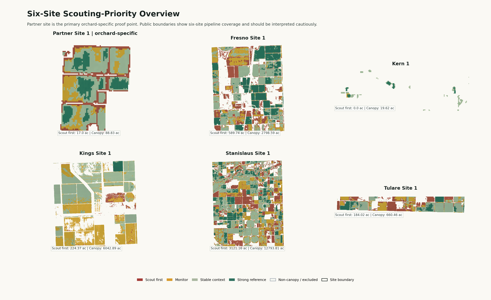
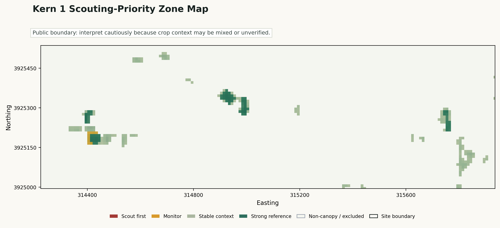
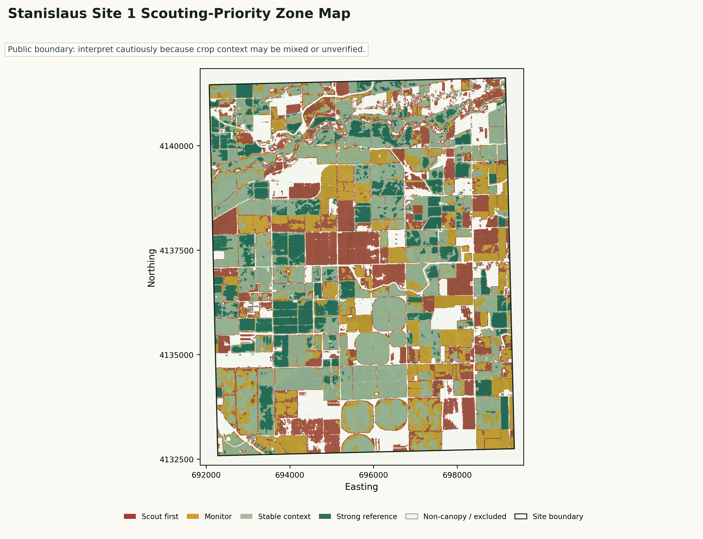
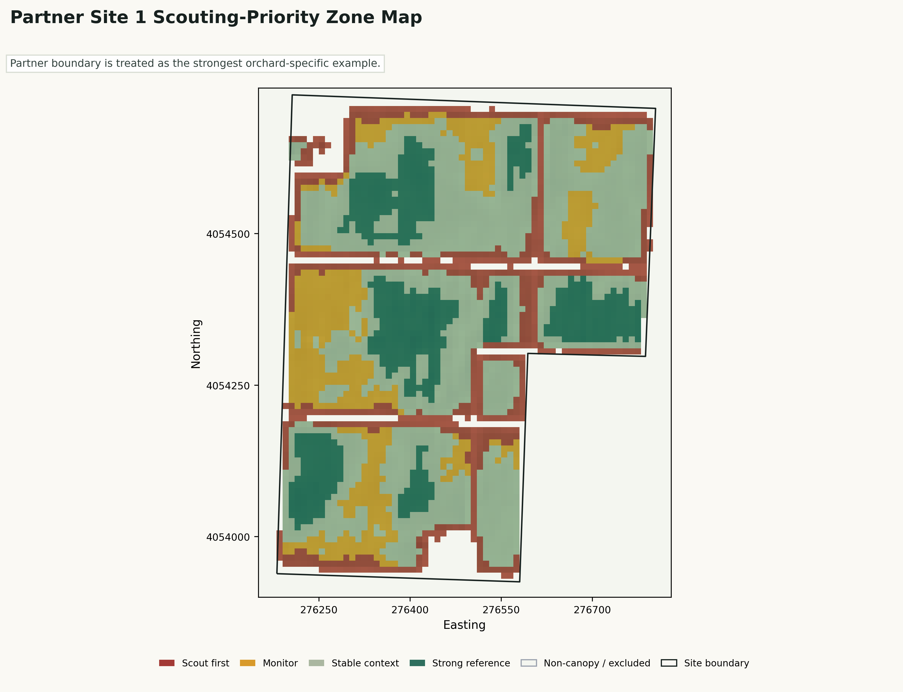
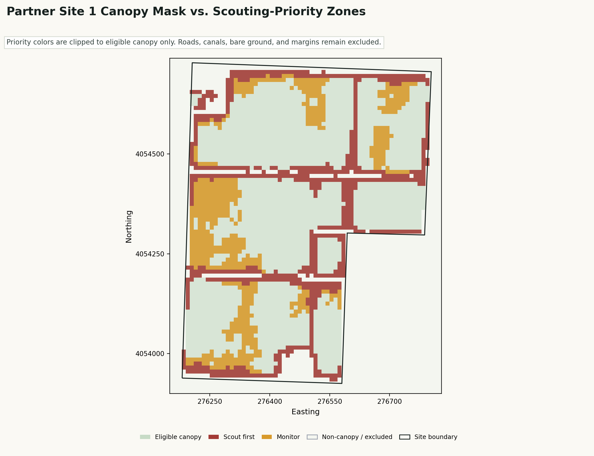

# Persistent Orchard Underperformance Mapper

F3 Innovate Data Challenge #2: Satellite-Based Orchard Stress Mapping

Repository: https://github.com/tienonic/f3innovate-project-submission

## One-Sentence Concept

This project turns Sentinel-2 L2A imagery into a grower-facing scouting-priority layer: it finds eligible canopy zones that persistently underperform relative to the same site's own baseline across NDVI, NDMI, NDRE, and EVI2.

Persistent Orchard Underperformance Mapper is a scouting-priority aid for growers, PCAs, crop advisors, and field crews. It converts multi-date Sentinel-2 vegetation evidence into conservative canopy-limited zones that can be checked against field memory, block maps, PCA notes, irrigation records, management records, and in-person scouting. The output does not diagnose cause or estimate yield; it helps decide where to look first, makes assumptions and confidence visible, and exports PDF, CSV, GeoJSON, and GeoTIFF products that fit existing spreadsheet and GIS workflows.

## Review Path

Open the final PDF first, then the live Vercel field map, the grower quickstart webpage, the scouting-priority table, the `partner_site_1` map, and the review guide. The PDF starts with a review path so a user can inspect the outputs without running the code first.

The review logic is simple: this is not just a map screenshot. It is a reproducible Sentinel-2 L2A pipeline, a canopy-limited persistent underperformance method, a grower-facing decision aid, and an audit trail that exports PDF, HTML, CSV, GeoJSON, GeoTIFF, and PNG products.

## Grower Quick Start

1. Open the site map.
2. Start with Scout first zones.
3. Compare each Scout first zone against a nearby Strong reference zone.
4. Check field memory, block maps, PCA notes, irrigation records, management records, and recent scouting notes.
5. Record what was found: confirmed concern, known context, no-action area, or needs revisit.
6. Do not assign cause from the satellite layer alone.

## Grower Decision Tree And Practical Field Brief

The field-facing decision tree is: open the site map and scouting-priority table, send a scout to the highest-ranked Scout first centroid, compare that area with a nearby Strong reference area, check visible canopy difference plus records, and record the finding as confirmed concern, known context, no action, or revisit later.

The short grower quickstart webpage, `submission/grower_quickstart.html`, packages this as a one-page field aid with embedded map visuals and an English/Spanish toggle. The practical field brief gives a concrete English/Spanish example of what a field crew or advisor could say without turning the map into a diagnosis.

Who receives the output depends on the field observation: the farm manager gets the worklist, the PCA or crop advisor gets crop symptoms and photos, the irrigation lead gets distribution concerns, and the data owner gets the feedback row for threshold calibration.

## How Additional Data Could Refine The Method

The submitted product stays focused on Sentinel-2 canopy-limited persistent underperformance and scouting priority. I did not ingest CIMIS, ERA5, OpenET, SSURGO, DEM, yield, irrigation, pest, disease, tissue, or soil-lab datasets into this run.

If those data were available, I would add them after the canopy-priority layer as explanatory context, not as automatic diagnosis. Weather and ET records could help decide whether to review irrigation timing, SSURGO or soil tests could help decide whether mapped zones line up with known soil variability, DEM or slope could help identify drainage questions, and grower records could separate expected management differences from unexpected weak canopy signals.

The safe workflow would be: first map persistent canopy underperformance, then compare it with additional records, then send a scout to verify what is actually happening. Any added data would need clear dates, field boundaries, resolution notes, and grower context before it could refine confidence.

## What Has Been Done

- Processed all six challenge boundaries: `fresno_site_1`, `kern_site_1`, `kings_site_1`, `partner_site_1`, `stanislaus_site_1`, and `tulare_site_1`.
- Computed Sentinel-2 L2A-derived NDVI, NDMI, NDRE, and EVI2.
- Applied clear-pixel filtering and Sentinel-2 SCL masking when available.
- Built a persistent canopy/vegetation eligibility mask before baseline calculation or scoring.
- Limited baseline statistics, priority zones, polygons, maps, and acreage summaries to eligible canopy pixels.
- Exported PDF, CSV, GeoJSON, GeoTIFF, PNG figures, canopy diagnostics, and verification outputs.

## Main Visuals











## Current Results

| Site | Eligible canopy area | Images used | Scout first | Monitor | Stable | Strong reference |
|---|---:|---:|---:|---:|---:|---:|
| fresno_site_1 | 2,798.59 acres | 8 | 589.74 acres (21.07%) | 450.37 acres (16.09%) | 1,064.21 acres (38.03%) | 694.27 acres (24.81%) |
| kern_site_1 | 19.62 acres | 8 | 0.00 acres (0.00%) | 0.22 acres (1.13%) | 17.57 acres (89.55%) | 1.83 acres (9.32%) |
| kings_site_1 | 6,042.89 acres | 8 | 224.37 acres (3.71%) | 2,685.05 acres (44.43%) | 2,990.47 acres (49.49%) | 143.00 acres (2.37%) |
| partner_site_1 | 88.83 acres | 8 | 17.00 acres (19.14%) | 15.35 acres (17.27%) | 40.03 acres (45.06%) | 16.46 acres (18.53%) |
| stanislaus_site_1 | 12,793.81 acres | 8 | 3,121.16 acres (24.40%) | 2,729.67 acres (21.34%) | 5,151.31 acres (40.26%) | 1,791.66 acres (14.00%) |
| tulare_site_1 | 660.46 acres | 8 | 184.02 acres (27.86%) | 129.85 acres (19.66%) | 260.35 acres (39.42%) | 86.24 acres (13.06%) |

`partner_site_1` is the clearest orchard-specific example because it is a cleaner orchard-scale block. Public sites are included for full-boundary pipeline coverage and should be interpreted cautiously because crop and management context may be mixed or unverified.

Kern 1 (`kern_site_1`) is a small-boundary check, not a weak visual result. It has 19.62 eligible canopy acres, 0.00 scout-first acres, and 0.22 monitor acres. The public-facing map is zoomed so the tiny boundary signal is readable. The useful result is that the pipeline can return a conservative low-priority field-follow-up map instead of forcing a problem zone.

`stanislaus_site_1` is the visually strongest public-site figure. Use it as a presentation visual, but keep the interpretation cautious because crop and management context are unverified.

## How To Trust A Zone

Confidence is operational, not diagnostic. It does not estimate the probability of disease, yield loss, or a specific cause.

A zone is more trustworthy when it:

- sits inside the persistent canopy mask;
- has enough clear Sentinel-2 observations;
- persists across years;
- is supported by several indices rather than one vegetation signal;
- appears in the orchard-specific partner boundary rather than an unverified public boundary.

A zone is more cautious when it comes from a public boundary, a tiny mapped patch, mixed crop context, or monitor-level evidence. These zones can still be useful, but they should be treated as field-follow-up prompts.

High confidence means good place to look first. It does not mean known cause.

## Partner Site 1 Evidence Cards

These are the highest-priority `partner_site_1` scout-first polygons. They are a field worklist, not cause labels.

## Zone Card Reading Guide

- Area = approximate field footprint.
- Persistence = how repeatedly the zone appeared weak across years.
- Indices triggered = which vegetation signals agreed.
- Valid obs = how many clear observations supported the zone.
- Mean relative underperformance = strength of the weaker signal relative to the site's own canopy baseline.
- Centroid = starting point for field follow-up, not a diagnosis point.

| Zone | Area | Persistence | Indices triggered | Valid obs | Mean relative underperformance | Centroid |
|---|---:|---:|---|---:|---:|---|
| `priority_002` | 0.07 ac | 1.00 | NDVI; NDMI; NDRE; EVI2 | 8 | 2.75 | 36.611171, -119.502198 |
| `priority_022` | 0.32 ac | 1.00 | NDVI; NDMI; NDRE; EVI2 | 8 | 1.75 | 36.608136, -119.496511 |
| `priority_025` | 1.38 ac | 0.97 | NDVI; NDMI; NDRE; EVI2 | 8 | 1.67 | 36.607520, -119.498485 |
| `priority_004` | 0.35 ac | 0.96 | NDVI; NDMI; NDRE; EVI2 | 8 | 2.51 | 36.610996, -119.501921 |
| `priority_021` | 9.56 ac | 0.91 | NDVI; NDMI; NDRE; EVI2 | 8 | 1.68 | 36.610039, -119.498739 |

Recommended follow-up for each card: scout the zone in the field; compare canopy condition with nearby strong-reference areas; review field memory, block maps, PCA notes, irrigation distribution records, management records, and recent scouting notes.

## Grower And Advisor Workflow

1. Open the site map before field scouting.
2. Visit scout-first zones before monitor zones.
3. Compare priority zones against nearby strong reference zones.
4. Check the satellite signal against field memory, block maps, PCA notes, irrigation records, management records, and direct scouting.
5. Record field findings so future versions can be calibrated against local knowledge.

Field verification is required to determine cause. The map is a ranked scouting signal, not a diagnosis.

## Refinement With Grower Data

The submitted version is intentionally transparent because it does not have ground-truth grower records. If field scouting labels were added, the thresholds could be tuned around confirmed concern, known context, no action, revisit later, and missed-signal cases. If irrigation sets, repairs, varieties, planting age, PCA notes, pruning, spray history, or replant records were available, the map could separate repeated weak signals from expected management patterns. If yield maps, bin counts, packout, or quality observations were available, the model could be checked against outcomes rather than only against vegetation-signal persistence.

Those additions would make the tool more accurate and more relevant to the grower: fewer false alerts, clearer confidence, better local calibration, and work orders that match how the block is actually managed.

## Method Summary

1. Read all F3 site boundaries from GeoJSON.
2. Search Sentinel-2 L2A scenes through public STAC providers.
3. Keep valid observations with cloud, shadow, snow/ice, water, and no-data masking.
4. Compute NDVI, NDMI, NDRE, and EVI2.
5. Build a persistent canopy/vegetation eligibility mask from multi-date clear observations.
6. Compute robust within-site baselines over eligible canopy pixels only.
7. Score persistent multi-index underperformance relative to each site's own eligible-canopy distribution.
8. Export maps, canopy diagnostics, GeoTIFF layers, GeoJSON management-zone polygons, summary tables, methodology notes, and scouting-priority CSV rows.

## Why This Is Useful

- It turns imagery into field workflow, not just a one-date vegetation-index picture.
- It uses within-site baselines instead of universal thresholds.
- It masks non-canopy areas before scoring, reducing road, canal, bare-ground, and field-margin artifacts.
- It keeps partner-site interpretation orchard-specific while treating public sites cautiously.
- It produces portable outputs for existing spreadsheet, GIS, and report workflows.
- It keeps causal interpretation with grower/advisor field follow-up.

## Primary Artifacts

- `submission/report/final_technical_report.pdf`
- `submission/grower_quickstart.html`
- `submission/tables/scouting_priority_table.csv`
- `submission/tables/spatial_zone_summary.csv`
- `submission/figures/spatial_zone_maps.png`
- `submission/figures/partner_site_1_report_zone_map.png`
- `submission/figures/partner_site_1_canopy_priority_overlay.png`
- `submission/geodata/partner_site_1_zones.geojson`

## Rebuild Commands

```powershell
python scripts\build_spatial_zones.py --sites all
python scripts\build_visual_overlays.py
python scripts\build_final_report_pdf.py --figures-dir output\figures --spatial-dir output\spatial --output output\report\final_technical_report.pdf
python scripts\verify_submission_outputs.py
```

## Limits

- The product is a scouting-priority layer, not a diagnosis tool.
- There is no verified yield ground truth, pest or disease confirmation, irrigation-system data, soil or tissue validation, or management-record validation.
- Public sites may be mixed landscape patches. The partner site is the clearest orchard-specific demonstration.
